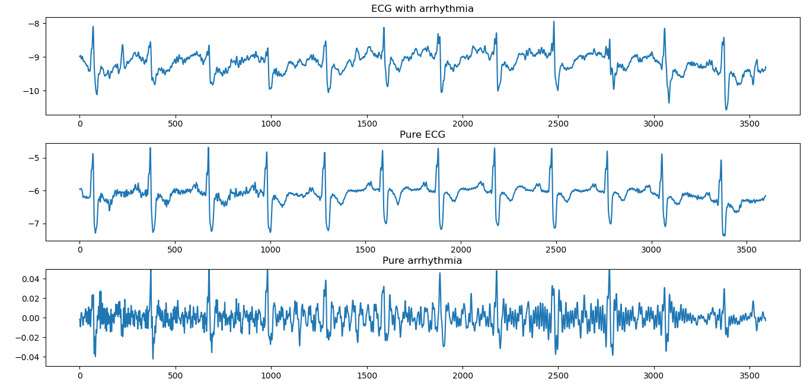
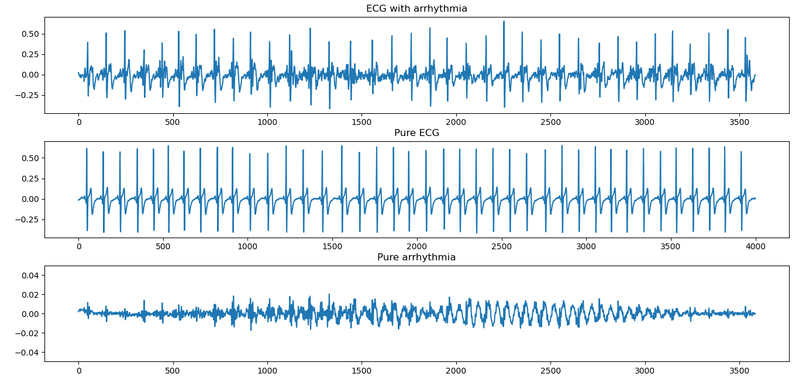

# Introduction
I used **librosa** for arrhythmia separation by applying two soft masks on the ecg file,
 one for extracting the pure ecg and the other for the arrhythmia.
 
# Output samples plots

### 1. Sample 1

### 2. Sample 2

#### Note: I got the two samples from two different sources so there's a quality difference between the two outputs